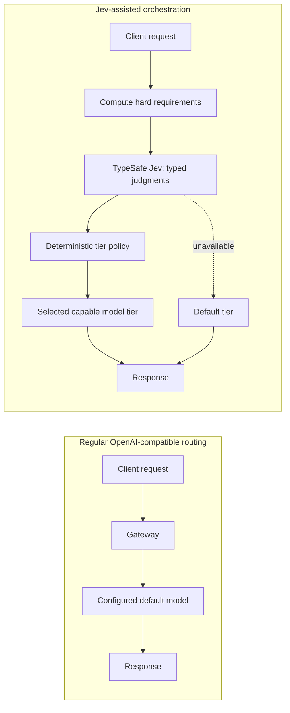
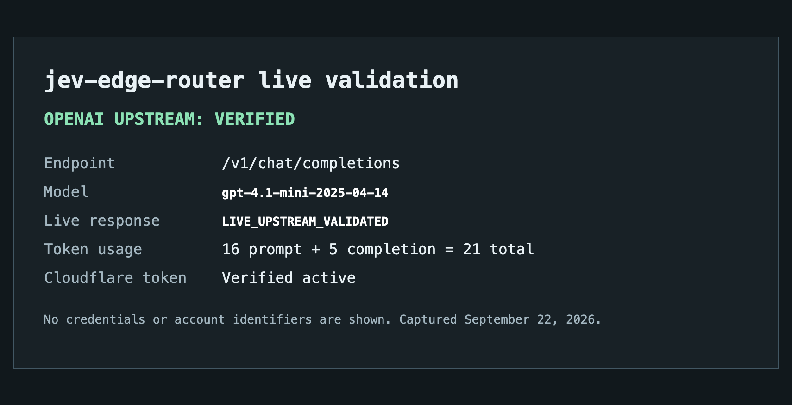
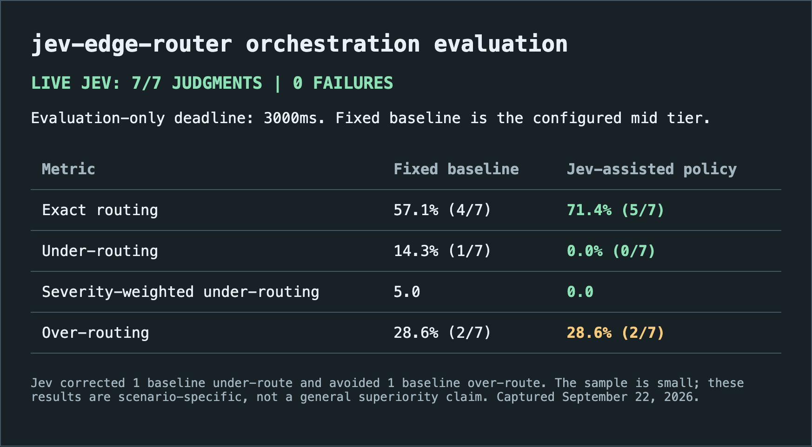

# jev-edge-router

[](LICENSE)


> An OpenAI-compatible model gateway for Cloudflare Workers that uses TypeSafe Jev to choose the
> cheapest configured model tier that can safely handle each request.

Most gateways send every request to a fixed default model. `jev-edge-router` first computes hard
requirements such as tool use, image input, and context size. Jev then answers four typed
questions about the request; a deterministic policy combines those judgments with the computed
requirements to select a tier. The selected upstream model produces the answer through the normal
OpenAI Chat Completions interface.

This keeps the routing decision observable and reversible: in `shadow` mode Jev decisions are
logged while the default tier still serves the request; in `route` mode the decision is applied;
and if Jev is unavailable, the gateway fails open to the configured default tier. Any OpenAI
compatible client can use it by changing its base URL.

## Fixed routing vs. Jev orchestration



Code calculates, Jev judges, the policy decides, the upstream model answers.

## Why Jev fits routing decisions

Jev is not presented here as a better answer-generating LLM. It is a better fit for this narrow
orchestration step because the router needs bounded, machine-checkable signals rather than an
open-ended explanation or a model's self-selected route. The deterministic policy remains the
authority for capability constraints, cost thresholds, escalation, and fallback.

| Decision property | General-purpose LLM used as a router | TypeSafe Jev in this router |
| --- | --- | --- |
| Expected result | Prompt-defined prose or JSON contract | Declared choice, score, and boolean questions |
| Route vocabulary | Must be constrained in the prompt and parsed afterward | Fixed task categories and score levels validated by schema |
| Uncertainty signal | Optional and prompt-dependent | Per-question confidence; boolean judgments also return probability |
| Deterministic requirements | Must be repeated in the routing prompt or rechecked later | Computed separately for tokens, tools, images, and pinned models |
| Routing authority | The LLM response can directly imply a model choice | A pure policy maps validated judgments and requirements to a tier |
| Failure behavior | Custom parsing and fallback are required | Deadline, low-confidence handling, and fail-open fallback are explicit |

This is a design comparison, not a claim that Jev is universally more capable, faster, or cheaper
than another LLM. It describes why its typed judgments are easier to audit and safely compose into
this router's policy.

---

## Integration prerequisite

The sanitized report below captures a real OpenAI-compatible upstream response, including its model
and token usage. It verifies an adapter prerequisite only; it is not evidence that Jev makes good
or useful orchestration decisions. It contains no credentials, account identifiers, request headers,
or raw prompt content.



---

## Architecture

```text
client (OpenAI-compatible)
   │  POST /v1/chat/completions
   ▼
Worker: src/index.ts
   ├─ auth
   ├─ features.ts      deterministic features (tokens, tools, images, pinned model)
   ├─ judge/           one Jev call, all questions in parallel, hard deadline, fail open
   ├─ policy.ts        features + judgments + config  ->  model tier (pure function)
   ├─ upstream/        provider adapter, streaming passthrough (SSE)
   └─ telemetry.ts     decision log to D1 (no prompt content by default)
```

Nothing outside `src/judge/providers/` and `src/upstream/providers/` knows which vendor is in
use. `judge.provider` picks between `cloudflare` (the Workers AI binding), `cloudflare-rest`
(`POST /accounts/{id}/ai/run`, for callers without the binding), `typesafe` and `vercel`.
Swapping is a config change.

If the judge times out, errors or answers with low confidence, the request is never blocked: it
falls back to `default_tier` or escalates one tier. A broken judge costs money, never
correctness.

## Start With This Template

Before adapting this project, replace `{{PROJECT_NAME}}` and the remaining placeholders in
`.openspec/config.yaml`, including the configured `{{TEST_COMMAND}}`. Follow the
[onboarding guide](docs/ONBOARDING.md) for the setup steps and [adoption guide](docs/ADOPTION.md)
for the governance and rollout checklist.

## Quick start

```bash
npm install
cp config/tiers.example.json config/tiers.json   # edit models, prices and thresholds

# The worker reads the config from the TIERS_CONFIG var.
npx wrangler secret put ROUTER_API_KEYS          # comma separated client keys
npx wrangler secret put UPSTREAM_API_KEY_MID     # one per tier, tier name upper-cased
npx wrangler d1 create jev-edge-router-db        # put the id in wrangler.toml
npx wrangler d1 migrations apply jev-edge-router-db

npm run dev
npm test
```

Point any OpenAI client at the worker:

```bash
curl http://localhost:8787/v1/chat/completions \
  -H 'authorization: Bearer <your router key>' \
  -H 'content-type: application/json' \
  -d '{"messages":[{"role":"user","content":"why is my worker returning 522?"}]}' -i
```

The response carries the decision in its headers:

```text
x-router-tier: mid                 tier that actually served the request
x-router-decided-tier: mid         tier the policy chose (differs in shadow mode)
x-router-reason: difficulty 2 maps to mid
x-router-judge-latency-ms: 180
```

## Modes

| `ROUTER_MODE` | Behaviour |
| --- | --- |
| `shadow` (default) | Call the judge, log the decision, always serve `default_tier`. Start here. |
| `route` | Apply the decision. |
| `off` | Bypass the judge entirely. Kill switch. |

## What Jev is asked

One request per routed call, four independent questions in the `typesafe/jev` schema:
`task_type` (a choice over ten categories), `difficulty` (a score over four concrete levels, so
the answer is a float from 0 to 3), and the nouls `needs_long_output` and `high_stakes`.
Only free text and the turn count are sent. Token counts, tool presence, images and model
pinning are computed in code and never asked. The set lives in `src/judge/questions.ts`; every
new question needs an eval result behind it.

## Routing policy

`src/policy.ts` is a pure function with no I/O. In order: honour client pinning when config
allows it; apply hard feature requirements (images, tool support, context window); fall back to
`default_tier` when the judge failed; map difficulty and task type through the config table;
escalate one tier below `min_confidence`; enforce `high_stakes_min_tier` above
`high_stakes_threshold`. Every decision returns a human readable reason.

## Eval

```bash
npm run eval -- eval/dataset.example.jsonl config/tiers.example.json

# Requires CLOUDFLARE_ACCOUNT_ID and CLOUDFLARE_API_TOKEN in the shell.
npm run eval -- --live eval/orchestration-scenarios.jsonl config/tiers.json

# Evaluation-only: measure Jev quality with a larger deadline; does not change production config.
npm run eval -- --live --deadline-ms=3000 eval/orchestration-scenarios.jsonl config/tiers.json
```

The question is whether Jev-assisted policy selects the cheapest adequate tier more safely than a
fixed default tier, not whether the judge returned HTTP `200`. Each scenario has a human-selected
cheapest acceptable tier and an under-routing severity weight assigned without seeing Jev output.
The live command always calls Jev and refuses to run without Cloudflare credentials; it never
replays a fixture. It reports both fixed-baseline and Jev-assisted exact routing, under-routing,
severity-weighted under-routing impact, over-routing, baseline errors corrected or avoided by Jev,
and confidence calibration. The supplied example dataset is replay-only policy coverage, not Jev
performance evidence.

The live report also distinguishes judge availability from decision quality. A timeout causes the
serving policy to fail open, but it is not counted as a valid Jev judgment when comparing Jev to
the baseline. `--deadline-ms` changes only the evaluator's budget, never the Worker configuration.

The live scenario set covers simple requests, coding and debugging, multi-step planning, long
deliverables, high-stakes review, image capability, and tool use. Review scenario-level
disagreements before changing thresholds or making comparative claims.

The latest sanitized live run completed all seven scenarios with a `3000 ms` evaluation-only
deadline. Jev-assisted policy improved exact routing from `57.1%` to `71.4%` and removed the
baseline's severity-weighted under-routing impact, while retaining two over-routes. This small,
scenario-specific sample is evidence to inspect, not a general superiority claim.



## Enterprise take

Jev is a credible **routing-signal component**, not an autonomous routing authority. In this
small live sample it removed the baseline's only high-severity under-route and improved exact
routing, while its typed output, deterministic policy, and decision telemetry make each route
reviewable. That is enough evidence to start a controlled adoption; it is not evidence to switch
all enterprise traffic to dynamic routing.

For the staged onboarding and governance model, see [the adoption guide](docs/ADOPTION.md).

**Recommended rollout:** run `shadow` mode against a representative, approved traffic sample;
review disagreements and latency by scenario family; then canary `route` mode for bounded,
non-sensitive workloads. Keep hard capability constraints, client pinning, and high-stakes floors
in deterministic policy, with fail-open to the fixed tier on any judge failure.

**Production gates:** establish p95/p99 judge latency and a deadline that preserves the user
experience; expand independently labeled scenarios before changing thresholds; obtain data-term
and residency approval before sending real content; add rate limiting and per-tenant cost limits;
and close the upstream tool/image translation gaps for every tier eligible to serve such traffic.
The observed REST response took about `1436 ms`, so the configured `400 ms` production deadline
currently favors availability through fail-open over dynamic-routing coverage.

## Telemetry and privacy

Every routed call writes one row to the D1 `decisions` table: features, the full judgment with
its probability distributions, the chosen tier, the reason, judge and upstream latency, token
usage and estimated cost against the cost of the top tier. Prompt content is **not** stored.
`LOG_CONTENT=true` exists only for local eval collection.

## Honest limitations

- **The completed Cloudflare REST envelope is normalized and unit-tested.** The parser accepts
  `{ success: true, result: { state: "Completed", result: ... } }` as well as direct and
  one-level results. A post-fix live probe normalized a REST response in about `1436 ms`. See
  [docs/jev-wire-format.md](docs/jev-wire-format.md).
- **The live Jev sample is small.** Seven labeled scenarios improved exact routing from `57.1%`
  to `71.4%` and eliminated under-routing in that sample, but are not sufficient to tune
  thresholds or claim general accuracy or superiority. The replay example contains hand-written
  judgments and must not be used as evidence.
- **The TypeSafe and Vercel judge endpoints are guesses.** Only the two Cloudflare paths are
  documented.
- **No rate limiting.** Client keys are authenticated but not throttled.
- **Token counts are estimated** at four characters per token, including the context window
  checks in the policy.
- **The Anthropic adapter translates text only.** Tool calls and image blocks are dropped.
- **The Workers AI judge path is untested locally**, because the binding cannot be simulated.

Full list, with status and workarounds, in [`KNOWN_ISSUES.md`](KNOWN_ISSUES.md).

## How this differs from jev-router

`jev-router` picks a model inside a CLI session (Claude Code, Codex). This is a network
gateway: the routing decision happens per HTTP request, for any client, behind one base URL.

---

## Contributing

This project uses **OpenSpec** for spec-driven development: every feature or bugfix starts with
a spec under `.openspec/specs/`. See [`docs/OPENSPEC.md`](docs/OPENSPEC.md) for the workflow and
[`CONTRIBUTING.md`](CONTRIBUTING.md) for the contributor checklist.

Commands: `npm test`, `npm run typecheck`, `bash scripts/openspec check`.

## Documentation

| Topic | Where |
| --- | --- |
| Jev wire format and how to verify it | [`docs/jev-wire-format.md`](docs/jev-wire-format.md) |
| Known issues | [`KNOWN_ISSUES.md`](KNOWN_ISSUES.md) |
| Spec-driven workflow | [`docs/OPENSPEC.md`](docs/OPENSPEC.md) |
| Guided project setup | [`docs/ONBOARDING.md`](docs/ONBOARDING.md) |
| Security policy | [`SECURITY.md`](SECURITY.md) |
| Release history | [`CHANGELOG.md`](CHANGELOG.md) |

---

## License

[Apache License 2.0](LICENSE)

---

## Developer

Eduardo Arana

## Support this with a ko-fi

[](https://ko-fi.com/H2H51MPWG)
